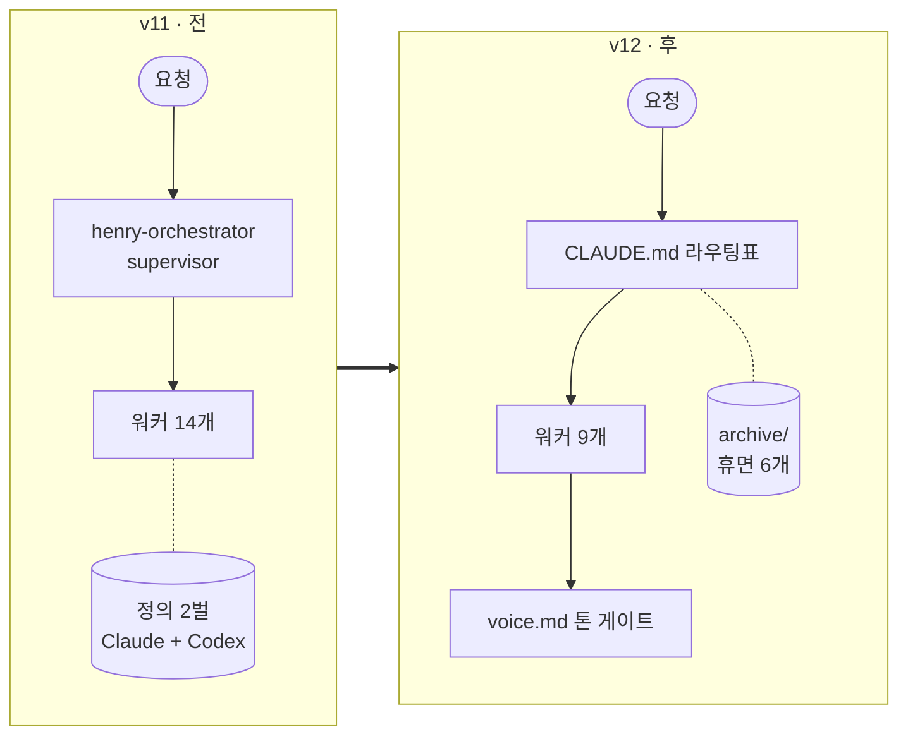
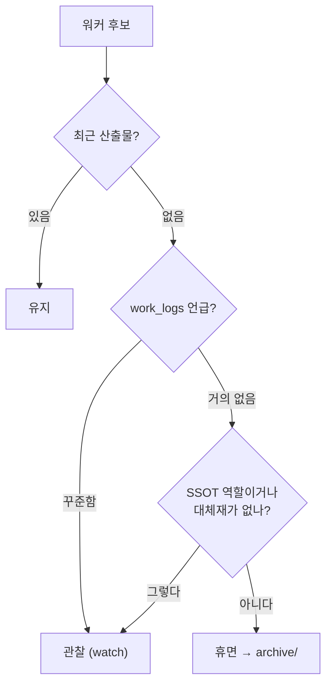
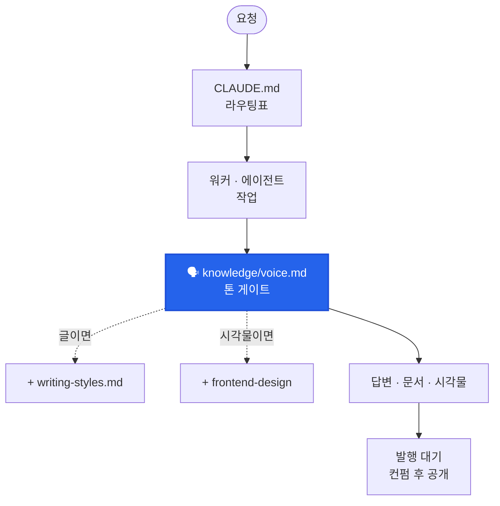

<div class="mc-cover" markdown="0"><span class="mc-cover-kicker">Case Study · Henry's Agentic System v12</span><div class="mc-cover-title">줄였더니 더 잘 돌아간다</div><div class="mc-cover-subtitle">반년 동안 감으로 쌓은 AI 하네스를 실측으로 걷어낸 기록</div></div>

> **3줄 요약**
> - 반년 동안 불어난 내 Claude Code 하네스를 **재 봤더니**, 워커 14개 중 6개는 산출물이 거의 없었고, Codex용 복사본 정의 40개 중 30개가 원본과 어긋나 있었다.
> - 지우지 않고 **재웠다(archive)**. 복사본(Codex 미러)과 안내데스크(supervisor 에이전트)는 없앴다. <mark>대화를 시작하기도 전에 매번 읽히는 분량이 31% 줄었다.</mark>
> - 다시 불어나지 않게 **구조를 매번 다시 재는 점검기(`harness_map.py --check`)**를 만들었다. 배선도 그림까지 실측에서 자동으로 그려진다.

**이런 분께 권해요** 🙋
- Claude Code·Cursor 같은 에이전트 도구에 규칙·에이전트·훅을 계속 붙여 온 분
- "만든 건 많은데 지금 뭐가 돌고 있는지 모르겠다"는 분
- 자동화를 늘리는 것보다 **유지하는 게** 더 어렵다고 느끼는 분

<div class="mc-card-grid mc-card-grid--3" markdown="0"><div class="mc-card mc-card--blue"><div class="mc-card-title">워커 14 → 9</div>산출물 없는 6개는 archive로<div class="mc-card-note">에이전트 14→8 · 스킬 11→7</div></div><div class="mc-card mc-card--teal"><div class="mc-card-title">고정 로딩 −31%</div>20,629자 → 14,253자<div class="mc-card-note">대화 시작 전 매번 나가는 비용</div></div><div class="mc-card mc-card--green"><div class="mc-card-title">정합성 이상 17 → 0</div>harness_map.py --check<div class="mc-card-note">어긋나면 exit 1</div></div></div>

---

> "이거 지금 몇 개가 실제로 돌고 있지?"

**Henry's Agentic System**은 내가 Claude Code 위에 직접 올린 개인 자동화 하네스다. 폴더 하나가 직원 한 명(워커)이고, 직원끼리는 말을 주고받지 않는다. 앞사람이 `output/` 트레이에 서류를 두면 뒷사람이 `input/` 트레이에서 가져간다. 블로그 발행, 지식 위키, MS 업데이트 추적, 교회 주보 게시, 결혼 준비까지 반년 동안 하나씩 맡겼다.

그런데 9월 어느 날, 위의 질문에 바로 답을 못 했다.

---

## 🏢 사무실이 왜 붐볐을까?

비유하자면 **직원을 뽑기만 하고 퇴사 처리는 한 번도 안 한 사무실**이었다.

새 일이 생기면 워커를 하나 만들었고, 한두 번 쓰고 나면 잊었다. 그래도 폴더와 정의 파일은 남는다. 에이전트는 출근할 때마다(=세션이 시작될 때마다) 사무실 안내문(`CLAUDE.md`와 메모리 인덱스)을 전부 읽고 들어온다. 안 쓰는 직원의 자리 배치도까지 매번 읽는 셈이다. 이게 **세션 고정 로딩**이고, 대화를 시작하기도 전에 나가는 비용이다.

여기에 두 가지가 더 얹혀 있었다.

- **매뉴얼이 두 권이었다.** Claude Code와 Codex를 둘 다 쓰려고 정의를 두 벌 유지했다 — `.claude/agents/*.md`와 `.codex/agents/*.toml`. 둘을 맞추는 동기화 스크립트(`sync_harness_mirror.py`)도 만들었다.
- **안내데스크가 있었다.** 요청이 오면 `henry-orchestrator` 에이전트가 먼저 받아서 어느 워커로 보낼지 정했다. 에이전트 팀 패턴으로 말하면 **supervisor** 구조다.



만들 때는 다 이유가 있었다. 문제는 아무도 다시 재 보지 않았다는 거였는데요.

---

## 🔍 재 보니 어땠을까?

감으로 "좀 무거운 것 같다"가 아니라, 디스크와 git 기록과 54건의 작업 로그(`work_logs/`)를 직접 셌다.

- **복사본 매뉴얼 40개 중 30개가 원본과 달랐다**(`sync_harness_mirror.py --check`). 그런데 작업 로그 54건 중 Codex를 실제로 쓴 건 2번뿐이었다.
- **워커 14개 중 6개는 산출물이 0건이거나 몇 달째 멈춰 있었다.** PPT 워커의 마지막 커밋 메시지는 "PPT는 토큰 너무 소모해"였다. 내가 이미 답을 적어 놓고 치우지 않은 거다.
- **안내데스크가 가리키는 연결 7개 중 6개가 이미 안 쓰는 직원이었다.** 게다가 supervisor를 한 단 거치면 같은 맥락을 두 번 쌓는다. 느리고 비싸다.
- **세션을 닫을 때 도는 SessionEnd 훅이 3중으로 걸려 최대 270초**를 붙잡았다.

그리고 제일 황당했던 건 이거다. 작업 폴더를 두 개(브랜치 두 개) 띄워 놓고 **같은 하네스를 양쪽에서 따로 정리하고 있었다.** 둘은 40커밋이나 벌어져 있었다. 어느 한쪽만 보고 진단했으면 어느 쪽이든 틀린 결론이 나왔을 거다.

---

## ✂️ 어떻게 줄였을까?

순서가 중요했다.

1. **먼저 합쳤다.** `main`을 병합하고 나서야 쟀다. 기준이 둘이면 진단도 둘이 된다.
2. **지우지 않고 재웠다.** 워커 6개(`ppt_team_agent`·`data_analysis`·`ideaing`·`retrospective`·`higgsfield`·`daily_brief`)와 거기 딸린 에이전트 5개·스킬 3개를 `archive/`로 옮기고 복구 절차를 남겼다. 쓸 만한 건 건져냈다 — 회고 워커가 모은 패턴은 공용 지식 문서로 승격했다. 되살리려면 "이번엔 왜 쓸 건지"부터 답하게 해 뒀다.
3. **안내데스크를 없앴다.** 라우팅은 `CLAUDE.md` 안의 표 하나로 정했다. 메인 세션이 그 표를 보고 바로 워커를 부른다. 지금 구조는 **expert pool**(키워드로 전문가 선택)에 얕은 **pipeline** 하나(MS 업데이트 → 문서)가 붙은 모양이다. 워커가 14개일 땐 supervisor가 말이 됐지만, 9개에 이어지는 경로가 하나뿐이면 중간 단은 비용만 낸다.
4. **복사본 매뉴얼을 없앴다.** 동기화 스크립트는 임시방편이었다. 돌리는 걸 잊는 순간 다시 어긋나고, 실제로 그렇게 됐다. 한 벌만 두니 어긋날 수가 없다.
5. **훅은 7개에서 2개로.** 처음 지시는 "훅 다 꺼"였다. 그런데 그중 둘은 음성 모드(말로 시키고 소리로 듣는 기능)의 본체였다 — `UserPromptSubmit`(토글)과 `Stop`(답변 낭독). 지시의 목적은 **속도**였으니 속도를 잡아먹던 SessionEnd 훅만 걷고 그 둘은 남겼다.

어떤 걸 내릴지는 세 가지를 같이 보고 정했다. 하나만 보면 틀린다.



예를 들어 `portfolio` 워커는 65일째 조용했지만 성과 데이터의 **원본(SSOT)**이라 재우지 않았다. 조용한 것과 필요 없는 건 다르다.

---

## 📐 다시 불어나지 않게 하려면?

줄이는 건 한 번이지만 붐비는 건 매일이다. 그래서 **사무실 도면을 매번 줄자로 다시 재는 장치**를 만들었다.

```bash
python tools/harness_map.py            # 실측 → JSON + 배선도(Mermaid) 주입
python tools/harness_map.py --check    # 정합성만 검사, 어긋나면 exit 1
```

`tools/harness_map.py`는 디스크와 git을 다시 읽어서 지금 실제로 있는 워커·에이전트·스킬·훅을 센다. `--check`를 붙이면 이런 걸 보고, 하나라도 어긋나면 실패로 끝난다.

- 라우팅표에는 있는데 폴더가 없는 워커(또는 그 반대)
- 아무도 부르지 않는 에이전트
- 폴더명과 호출 이름이 다른 스킬
- 이미 내린 것을 아직 가리키는 문서
- 예산(20,000자)을 넘긴 고정 로딩
- 실측과 달라진 배선도
- 톤 기준(`voice.md`)을 거치지 않는 산출 경로

처음 돌렸을 때 **17건**이 걸렸고, 지금은 **0건**이다.

배선도 그림도 같은 스크립트가 그린다. 실측 데이터를 **Mermaid** flowchart로 바꿔 `ARCHITECTURE.md`에 끼워 넣고, 누가 손으로 고치면 `--check`가 잡는다. 이 리포에서 손으로 관리하던 목록은 **예외 없이** 어긋났다 — 라우팅표도, 오케스트레이터 명단도, 복사본 매뉴얼도. <mark>손으로 그린 그림은 그리는 순간부터 낡는다.</mark>

리포를 넣으면 다이어그램을 그려 주는 외부 서비스(GitDiagram·Swark)도 후보였다. 편하긴 한데 이 리포에는 외부로 내보내면 안 되는 자료가 섞여 있어서 기각했다. 파일 구조를 그려 주는 도구(GitNexus)는 내가 알고 싶은 "요청이 어디로 흐르는가"를 못 보여 줬다.

재는 과정에서 배운 게 둘 더 있다.

- **단위 하나가 경고를 무력화한다.** 고정 로딩 예산을 바이트로 재고 있었는데 기준선은 글자 수였다. 한글은 UTF-8에서 한 글자가 3바이트라 경고가 **항상** 켜져 있었다. 늘 켜진 경고는 곧 무시된다. 글자 수로 고쳤다.
- **리포 밖에도 층이 있다.** 브리핑 워커를 재웠는데 다음 날 아침에도 브리핑이 생성됐다. 클라우드 예약 작업(루틴)이 따로 돌고 있었던 거다. 웹에서만 지울 수 있는 층이라 코드를 정리해도 안 멈춘다. 폐기 체크리스트에 "클라우드 루틴"을 추가했다.

---

## 🗣️ 덤으로, 말투도 한 군데서

정리를 마칠 즈음 AI 답변이 딱딱하다는 걸 느꼈다. 문체 규칙은 블로그·보고서용뿐이었고, 그마저 세 군데(`writing-styles.md`, `.claude/styles/` 3종, 에이전트별 사본)에 흩어져 서로 달랐다.

기준을 지어내지 않고 **작업 로그 54건에서 내가 실제로 "어렵다 / 쉽다 / AI 같다"고 말한 순간**을 모았다. "지금도 어려워"는 예시와 결론이 앞에 없을 때였고, "표 말고 항목별로"는 설명을 표에 욱여넣었을 때였다. 이걸 `knowledge/voice.md` 하나로 묶었다.

중요한 건 이걸 **별도 단계로 두지 않은 것**이다. 따로 부르는 명령은 결국 안 쓰인다. 대신 에이전트 8개와 발행·보고 스킬이 결과를 내보내기 직전에 이 파일을 거치게 박았고, `--check`가 그 연결이 끊겼는지도 확인한다.



---

## 📊 그래서 얼마나 달라졌을까?

| 지표 | 전 | 후 | 뜻 |
|------|----|----|----|
| 워커 | 14 | 9 (+휴면 6) | 실제로 일하는 직원만 자리에 |
| 에이전트 | 14 | 8 | 재운 워커에 딸린 것까지 함께 정리 |
| 스킬 | 11 | 7 | 〃 |
| 정의 파일 벌 수 | 2 | 1 | Codex 미러 폐기 |
| 훅 | 7 | 2 | 음성 모드만 |
| 세션 고정 로딩 | 20,629자 | **14,253자 (−31%)** | 대화 시작 전 매번 나가는 비용 |
| 정합성 이상 | 17건 | **0건** | `--check` 기준 |

말투 규칙을 얹은 뒤 고정 로딩은 14,946자가 됐다. 그래도 처음보다 **28% 가볍다.**

---

## 🌱 줄이는 것도 설계였다

마치 이사 전날 짐 정리 같았다. 박스를 열 때마다 "이거 언제 샀더라" 싶은 물건이 나오고, 버리긴 아까워서 창고에 넣고, 정작 매일 쓰는 건 몇 개 안 된다는 걸 그때 안다.

이번에 남은 원칙은 세 줄이다.

- 손으로 관리하는 목록은 반드시 어긋난다. **재는 장치로 바꾼다.**
- 안 쓰는 건 지우지 말고 **재운다.** 되살릴 땐 이유부터.
- 한 단 더 거치는 구조는 **그만큼의 값**을 낸다. 패턴은 규모에 맞춘다.

자동화를 늘리는 것보다 **줄일 줄 아는 게** 더 어려웠다. 다음 정리는 또 재 보고 시작하면 된다! 📏

더 자세한 방법론과 기술 디테일은 위키에 따로 정리해 뒀다.

- [하네스 다이어트: 실측으로 워커를 내리는 법](/wiki/concept-harness-diet-measurement-driven-pruning/) — 판단 기준, 폐기 체크리스트
- [그림도 검사 대상으로: 실측에서 생성하는 배선도](/wiki/concept-generated-diagrams-as-consistency-checks/) — `--check` 7항목, 도구 비교
- [Henry Agentic System](/wiki/entity-henry-agentic-system/) — 지금 구조 한눈에

#ClaudeCode #하네스엔지니어링 #멀티에이전트 #에이전틱시스템 #Mermaid #자동화 #최적화
