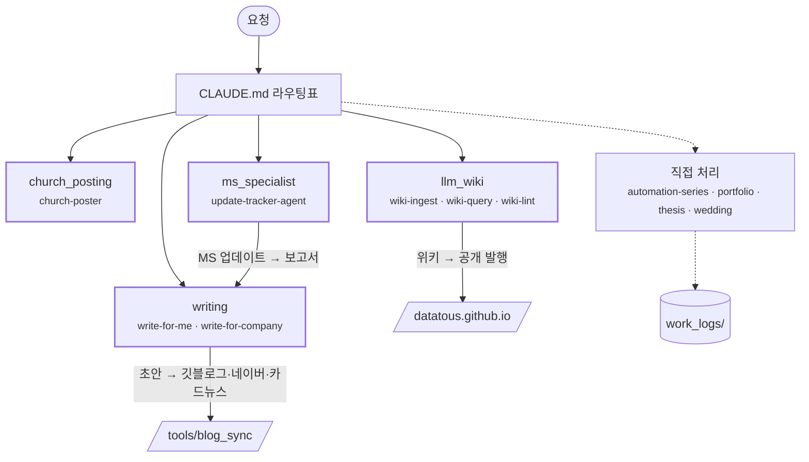
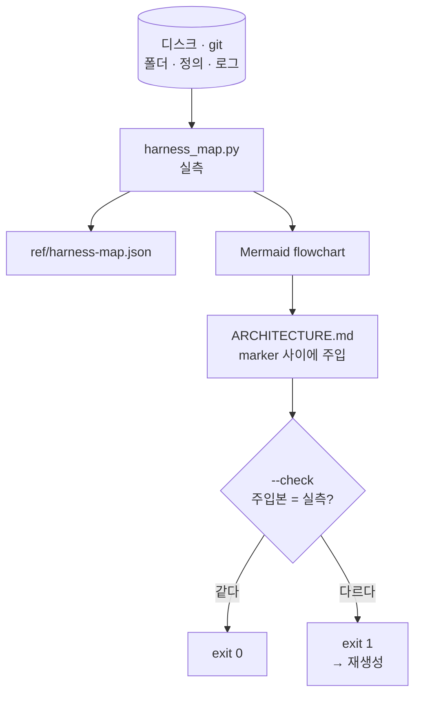
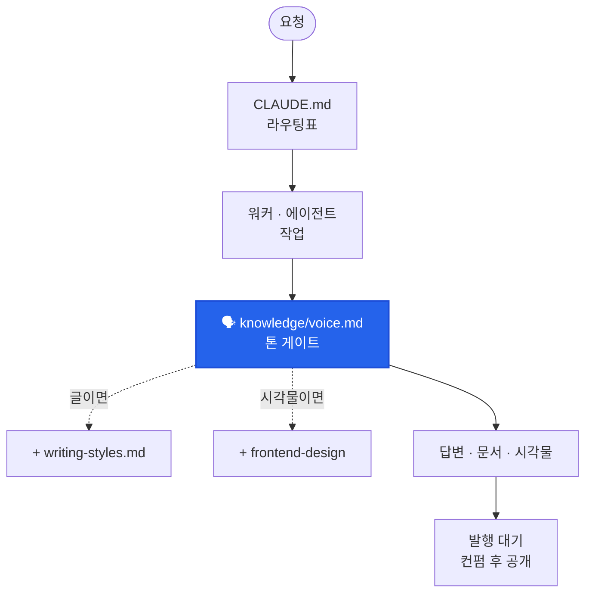

<span class="wiki-type-badge">concept</span>

## Summary
> **한 줄로** — 손으로 그린 그림은 그리는 순간부터 낡는다. 그래서 **그림은 스크립트가 실측에서 그리고, 그림이 실측과 다르면 `--check`가 exit 1로 실패하게 했다.** 그림이 문서가 아니라 테스트가 된다.

건물 도면에 비유하면 쉽다. 도면을 한 번 그려 벽에 붙여 두면 리모델링할 때마다 조금씩 틀려진다. 그렇다고 매번 사람이 다시 그리는 것도 잊기 쉽다. 내 하네스는 방식을 바꿨다. **매번 줄자로 다시 재서 도면을 새로 뽑고, 벽에 붙은 도면과 다르면 경보가 울린다.** 여기서 줄자는 `tools/harness_map.py`고, 도면은 Mermaid로 그린 flowchart다.

## Key Facts
- **Mermaid를 골랐다** — GitHub이 ` ```mermaid ` 펜스를 네이티브로 렌더하고(2022~), Claude Artifact도 렌더한다. 텍스트라서 git diff에 찍히고 PR에서 리뷰된다. 무엇보다 **스크립트가 생성할 수 있다.**
- **생성 → 주입** — `harness_map.py`가 디스크와 git을 실측해서 `ref/harness-map.json`을 만들고, flowchart를 `ARCHITECTURE.md`의 `<!-- harness-map:begin -->`~`<!-- harness-map:end -->` 사이에 끼워 넣는다.
- **검사** — `--check`는 주입된 그림이 최신 실측과 다르면 exit 1. 라우팅·에이전트·스킬·참조·예산·톤 게이트까지 7가지를 본다. v12 첫 실행에서 17건이 걸렸고 지금은 0건이다.
- **외부 자동 생성 서비스는 기각** — GitDiagram·Swark 같은 서비스는 리포를 외부 LLM에 넘겨야 한다. 외부로 보낼 수 없는 자료가 섞인 리포라 처음부터 불가였다. 성능 문제가 아니라 **데이터 경계** 문제라서 도구가 좋아져도 답이 안 바뀐다.

## Details

### 실제로 생성된 그림

예부터 보자. 아래가 `harness_map.py`가 2026-09-23에 실측해서 `ARCHITECTURE.md`에 넣은 그림 그대로다. 사람이 한 줄도 안 그렸다.



누가 이 블록을 손으로 고치거나, 워커를 추가해 놓고 스크립트를 안 돌리면 `--check`가 바로 잡는다.

### 생성과 검사는 따로 필요하다



- **생성만 있으면** "최신으로 만드는 법"은 생기지만 "최신을 강제하는 법"은 없다. 결국 "스크립트 돌리는 걸 잊었다"로 돌아간다. 동기화 스크립트를 두고도 Codex 미러가 30개 어긋났던 것과 같은 이야기다.
- **검사만 있으면** 어긋난 걸 알아도 고치는 게 수작업이다.
- 둘이 같이 있어야 "잊어도 걸리고, 걸리면 한 줄로 고친다"가 된다.

```bash
python tools/harness_map.py            # 실측 → JSON + Mermaid 주입 + 콘솔 요약
python tools/harness_map.py --check    # 정합성만 검사, 어긋나면 exit 1
```

워커·에이전트·스킬을 넣거나 뺀 **직후**에 돌린다. `/status`·`/optimize` 스킬도 내부에서 이걸 호출한다.

### `--check`가 보는 일곱 가지

1. 라우팅표 ↔ 디스크 — 표에는 있는데 폴더가 없거나, 그 반대
2. 아무도 부르지 않는 에이전트
3. 스킬 폴더명 ↔ frontmatter `name` 불일치 — 어긋나면 호출명이 조용히 폴더명으로 바뀐다
4. 이미 휴면·폐기된 대상을 아직 가리키는 문서
5. 세션 고정 로딩이 예산(20,000자)을 넘는지
6. `ARCHITECTURE.md`에 박힌 그림이 실측과 같은지
7. 톤 게이트 배선 — `CLAUDE.md`와 에이전트 8개가 모두 `knowledge/voice.md`를 거치는지 (현재 8/8)

못 보는 것도 있다. **리포 밖 층**(클라우드 루틴 등)과 **파이썬 import 참조**다. 실제로 v12 직후 `hook_gate.py`를 archive로 옮긴 뒤 이걸 import하던 `publish_wiki.py`가 멈춰 있었는데, `--check`는 0건이었다.

### 그림이 그리는 약속까지 검사한다 — 톤 게이트

7번이 이 페이지에서 제일 중요하다고 생각한다. 그림이 실측과 똑같아도, **그림이 약속하는 흐름을 실제로 안 지키면** 그림은 거짓말을 하는 셈이다.

내 하네스는 답변·문서·시각물이 나가기 전에 전부 `knowledge/voice.md`(톤 SSOT)를 거친다. 이걸 "나가기 전에 `/voice-check`를 부르세요" 같은 별도 명령으로 만들면 결국 안 쓰인다. 그래서 **이미 항상 지나가는 길목**에 박았다 — 에이전트 8개의 "내보내기 직전" 단계와 `publish-post`·`status`·`optimize`·`save-log` 스킬 안에. 그리고 `--check`가 그 연결이 끊겼는지 본다.



### 다른 도구는 왜 안 썼나

| 후보 | 무엇인가 | 안 맞는 이유 |
|------|---------|------------|
| Structurizr / C4 | DSL로 모델을 쓰면 여러 뷰를 뽑는 models-as-code | 컨테이너·컴포넌트 같은 소프트웨어 어휘라 마크다운 에이전트 정의 하네스에 겉돈다. Java CLI 의존 |
| GitDiagram · Swark · Datadef | 리포를 LLM에 넣어 다이어그램 자동 생성 | 리포를 외부로 보내야 한다. 코드 AST 기반이라 폴더 규약 구조에선 뽑을 게 없다 |
| GitNexus · Git Visualizer | 파일·import 그래프 시각화 | 보여주는 게 **파일 구조**다. 알고 싶은 건 **요청이 어디로 흐르는가** |
| Gource | 커밋 이력 애니메이션 | 회고용으로는 재밌지만 운영 지도가 아니다 |

Mermaid에도 한계는 있다. `architecture-beta`의 아이콘 팩은 GitHub·GitLab·Notion·Confluence 어디서도 안 뜬다. 그래서 flowchart 같은 코어 문법만 쓴다.

### 조직도가 아니라 배선도로 그린다

처음엔 "누가 누구 밑에 있나" 식의 조직도로 그렸다. 그런데 이 하네스의 워커들은 서로 말을 주고받지 않는다. 앞 워커가 `output/`에 떨군 파일을 뒷 워커가 `input/`에서 집어 갈 뿐이다. 그래서 **선이 이어져 있으면 일이 흐르고, 끊겨 있으면 안 흐르는 배선도**로 그리는 게 맞았다. 톤 게이트처럼 모든 산출이 한 점으로 모이는 구조도 배선도에서만 보인다.

## Connections
- → [하네스 다이어트: 실측으로 워커를 내리는 법](/wiki/concept-harness-diet-measurement-driven-pruning/) : 짝이 되는 원칙. 저기가 "무엇을 내릴까"라면 여기는 "줄인 구조를 어떻게 안 낡게 지킬까"
- → [Henry Agentic System](/wiki/entity-henry-agentic-system/) : 이 생성·검사 장치가 돌고 있는 하네스
- → [Harness Engineering](/wiki/concept-harness-engineering/) : Feedforward·Deterministic 방어의 구체 사례 — 그림 생성 자체가 가드레일이다

## Open Questions
- `--check`가 실패하면 지금은 내가 재실행한다. 실패 시 자동 재생성까지 붙일지는 미정이다.
- 검사 범위를 리포 밖 층(클라우드 루틴)과 파이썬 import 참조로 넓힐지 고민 중이다.

<p class="wiki-sources"><b>근거 자료</b> <code>024-harness-generated-diagram-check-gate-2026-09-23.md</code> · <code>026-harness-v12-technical-details-2026-09-23.md</code> · <code>025-wiki-publish-pipeline-fixes-2026-09-23.md</code></p>
