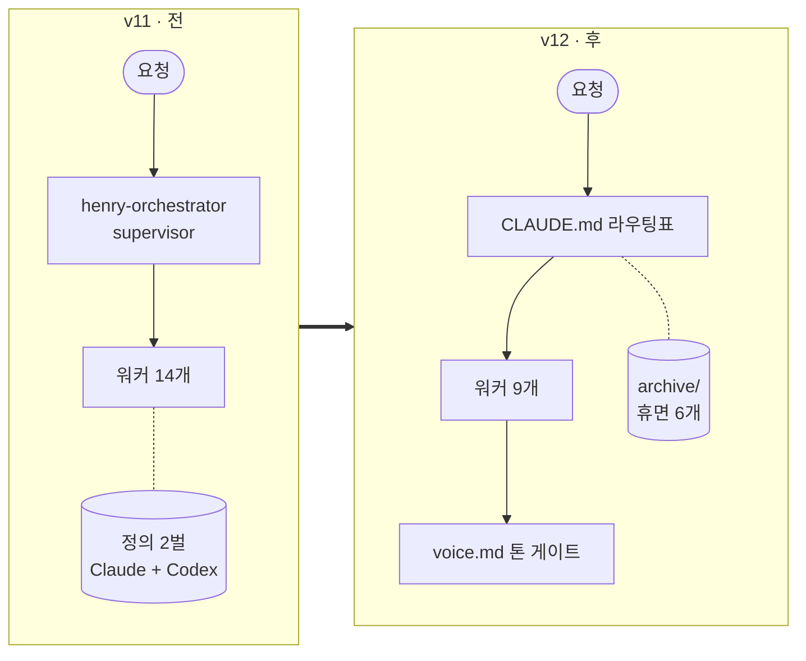
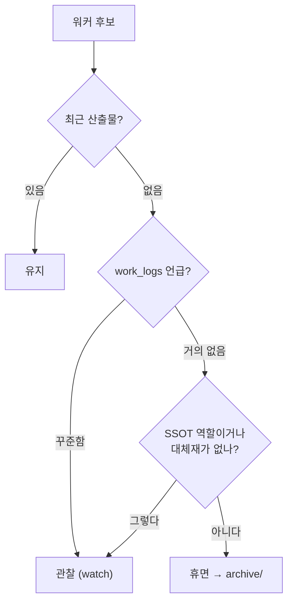

concept

## Summary
> **한 줄로** — 안 쓰는 워커는 감으로 못 지운다. **재 보고, 지우지 말고 재우고(archive), 리포 밖까지 따라가서 끈다.**

에이전틱 하네스는 늘리기는 쉬운데 줄이기가 어렵다. 내 Claude Code 하네스는 반년 만에 워커 14개·에이전트 14개·스킬 11개로 불었다. 2026-09-23 v12 정리에서 이걸 **워커 9 · 에이전트 8 · 스킬 7**로 줄였고, 세션을 열 때마다 무조건 읽히는 고정 컨텍스트는 **20,629자 → 14,253자(−31%)**가 됐다. 이 페이지는 그때 쓴 판단 기준과 밟은 함정을 정리한 것이다.

## Key Facts
- **Codex 미러 폐기** — Claude(`.claude/agents/*.md`)와 Codex(`.codex/agents/*.toml`, `.agents/skills/`)에 정의를 2벌 두고 있었다. `sync_harness_mirror.py --check`를 돌리니 40개 중 **30개가 drift**. 그런데 work_logs 54건 중 Codex를 실제로 쓴 건 **2건**이었다.
- **워커 6개 휴면** — `ppt_team_agent` · `data_analysis` · `ideaing` · `retrospective` · `higgsfield` · `daily_brief`. 삭제가 아니라 `archive/hibernated-workers/`로 옮겼다.
- **supervisor 에이전트 폐기** — `henry-orchestrator`가 가리키는 복합 라우팅 7건 중 6건이 이미 휴면 대상이었다. 라우팅 SSOT는 `CLAUDE.md` 표 하나로.
- **훅 7개 → 2개** — SessionEnd 3중 훅(최대 270초)·알림·PreToolUse 보안 훅을 걷고, 음성 모드 본체인 `UserPromptSubmit`·`Stop` 두 개만 남겼다.
- **정합성 이상 17건 → 0건** — `tools/harness_map.py --check` 기준.

## Details

### 한눈에 — 전과 후

| 지표 | 전 | 후 |
|------|----|----|
| 워커 | 14 | 9 (+휴면 6) |
| 에이전트 | 14 | 8 |
| 스킬 | 11 | 7 |
| 정의 파일 벌 수 | 2 (Claude + Codex) | 1 |
| 훅 | 7 | 2 |
| 세션 고정 로딩 | 20,629자 | 14,253자 (−31%) |
| 정합성 이상 | 17건 | 0건 |

### 1. 내릴지 말지는 세 가지를 같이 본다

예부터 보면 이렇다. PPT 워커(`ppt_team_agent`)의 마지막 산출물은 2026-04-30이었다. 그날 커밋 메시지가 **"PPT는 토큰 너무 소모해"**였다. 나는 이미 답을 적어 놓고 치우지 않았던 거다.

이런 걸 감이 아니라 판단으로 바꾸려면 세 가지를 같이 봐야 한다. 하나만 보면 틀린다.

- **마지막 산출물** — `output/` 파일과 git log. 단, 1년에 한 번 쓰는 계절성 워커는 오판할 수 있다.
- **work_logs 언급 횟수** — 호출 횟수가 아니라 **프록시**다. 이름만 나오고 실행은 안 됐을 수 있다.
- **참조 생존** — 그 워커를 가리키는 라우팅표·에이전트·문서가 아직 살아 있나.

반대 사례도 있다. `portfolio` 워커는 65일째 조용했지만 **성과 데이터의 SSOT**라 휴면시키지 않고 관찰로 뒀다. 조용한 것과 필요 없는 건 다르다.

### 2. 지우지 말고 재운다

휴면은 삭제가 아니라 **이사**다. `archive/hibernated-workers/<이름>/`로 옮기고 복구 절차를 `ARCHITECTURE.md`에 남겼다. 판단은 틀릴 수 있고, 지운 걸 되살리는 비용은 옮기는 비용보다 훨씬 크다.

- **딸린 정의도 같이 옮긴다.** 워커만 옮기고 에이전트 5종(`eda-agent`, `idea-generator`, `retro-agent`, `ppt-planner`, `ppt-builder`)·스킬 3종(`chart-skill`, `design-skill`, `pptx-skill`)을 남겨두면 "아무도 안 부르는 에이전트"가 된다. `--check`가 바로 이걸 잡는다.
- **건질 건 먼저 건진다.** 회고 워커가 모은 패턴은 `ref/insights/cross-project-patterns.md`로 승격했다. 워커는 사라져도 지식은 남는다.
- **되살릴 땐 이유부터.** "이번엔 왜 쓸 건지"에 답하지 못하면 같은 설계가 같은 결과를 낸다.

### 3. 라우터는 워커 수에 맞춘다

revfactory/harness가 Claude Code 팀 구조를 여섯 가지로 이름 붙였다 — **pipeline · fan-out/fan-in · expert pool · producer-reviewer · supervisor · hierarchical delegation**. 이 어휘로 보니 판단이 쉬워졌다.

- 지금 내 하네스는 **expert pool**(키워드로 도메인 전문가 선택) + 얕은 **pipeline** 하나(MS 업데이트 → 문서)다.
- `henry-orchestrator`는 **supervisor**였다. 워커가 14개일 땐 말이 됐다. 복합 경로가 1개뿐인 지금은 중간 단을 한 번 더 거치면서 **컨텍스트만 두 번 쌓는다.**
- 8월엔 사수/부사수 구조(**producer-reviewer**)도 5개월 가동률 0%로 내렸다.

패턴이 좋고 나쁜 게 아니다. **규모에 맞는 패턴**이 있을 뿐이다.

### 4. 복사본은 동기화하지 말고 없앤다

정의를 두 벌 둘 때 `sync_harness_mirror.py`라는 동기화 스크립트를 만들었다. 임시방편이었다. **돌리는 걸 잊는 순간 다시 어긋나고,** 실제로 그렇게 30개가 어긋났다. 한 벌만 두면 어긋날 수가 없다. `AGENTS.md`는 6,372B에서 841B짜리 포인터(CLAUDE.md를 가리킴 + 복구 절차)가 됐다.

### 5. 지시의 목적을 본다 — 훅 사례

09-08에 "hook 다 꺼"라고 지시해서 세 scope(`.codex/hooks.json`, `.claude/settings.local.json`, `~/.claude/settings.json`)의 command **24개**를 전부 껐다. 그런데 그중 둘은 음성 모드의 본체였다 — `UserPromptSubmit`의 `voice-hook.ps1`(토글)과 `Stop`의 `session_notify.ps1`(답변 낭독). 지시의 **목적은 속도**였으니 속도에 영향을 주는 것만 끄면 된다. 실제 범인은 SessionEnd 3중 훅(최대 270초)이었다. 그래서 v12에서는 그 둘만 남겼다.

### 6. 내릴 땐 참조를 끝까지 따라간다

정의 파일만 옮기면 절반이다. 예전에 훅 설정을 안 따라가서 **죽은 훅이 한 달을 더 돌았다**(툴 호출마다 약 1초). v12에서도 똑같은 일이 한 번 더 있었다. 훅 전용 헬퍼 `hook_gate.py`를 archive로 옮겼는데, `publish_wiki.py`가 이걸 파일 최상단에서 `import`하고 있어서 **위키 발행이 통째로 멈춰 있었다.** `--check`는 파이썬 import까지는 안 본다.

### 7. 단위 하나가 경고를 죽인다

고정 로딩 예산 기준선 20,629는 **문자 수**였다. 그런데 검사는 **바이트**로 하고 있었다. 한글은 UTF-8에서 한 글자가 3바이트라 경고가 **항상** 켜져 있었다. 늘 켜진 경고는 곧 무시된다. `harness_map.py`는 문자 수로 재고, 예산은 20,000자다.

### 8. 리포 밖에도 층이 있다

`daily_brief`를 재웠는데 다음 날 아침에도 브리핑이 생성됐다. 클라우드 루틴 `daily-brief-weekday-morning`이 따로 돌고 있었던 거다. 이건 claude.ai/code/routines 웹에서만 지울 수 있어서 코드를 정리해도 안 멈춘다. 그래서 폐기 체크리스트를 이렇게 바꿨다.

1. 워커 폴더 + 딸린 에이전트·스킬 정의 → `archive/`
2. `CLAUDE.md` 라우팅표에서 빼고 휴면 표에 추가
3. 훅 설정(`settings*.json`)
4. 다른 문서·스크립트의 참조 — **import 포함**
5. **리포 밖** — 클라우드 루틴, 외부 스케줄러, MCP 연결
6. `python tools/harness_map.py --check` → 0 issues

### 9. 갈라진 상태로 진단하지 않는다

정리를 시작하고 보니 작업 브랜치(`datatous/Opti`)가 `main`보다 **40커밋** 뒤처져 있었다. 두 쪽이 같은 하네스를 따로 정리하고 있었던 거다. 한쪽은 `tools/project_*.py`를 내렸고, 다른 쪽은 hookless 전환과 미러 동기화를 만들었다. 어느 쪽 기준으로 재도 틀린 숫자가 나온다. 그래서 **main부터 병합**(충돌 3건: `settings.local.json`, `.codex/hooks.json`, `ARCHITECTURE.md`)하고 나서 쟀다. 그 뒤로 정리는 main 한 곳에서만 한다.

## Connections
- → [Henry Agentic System](/wiki/entity-henry-agentic-system/) : 이 방법론을 실제로 적용한 하네스의 현재 구조
- → [그림도 검사 대상으로: 실측에서 생성하는 배선도](/wiki/concept-generated-diagrams-as-consistency-checks/) : 짝이 되는 원칙. 여기가 "무엇을 내릴까"라면 저기는 "줄인 구조를 어떻게 안 낡게 지킬까"
- → [Harness Engineering](/wiki/concept-harness-engineering/) : 하네스를 하나의 시스템으로 다루는 상위 관점
- → [12 Agentic Harness Patterns](/wiki/concept-12-harness-patterns/) : 여기서 폐기한 supervisor와 겹치는 오케스트레이션 패턴이 있다. 패턴의 가치는 워커 수·분기 수에 따라 달라진다
- → [문서 리포가 부푸는 진짜 원인 — 백업의 백업](/wiki/concept-repo-doc-sprawl-diagnosis/) : 같은 계열의 교훈. 리포가 부푸는 건 추가가 아니라 안 치우는 데서 온다

## Open Questions
- 세 기준 중 하나만 걸리는 워커를 어떻게 할지는 아직 명시 기준이 없다. 지금은 내가 하나씩 판단한다.
- 리포 밖 층(클라우드 루틴 등)과 파이썬 import 참조는 `--check`가 못 본다. 자동 점검으로 넓힐지 고민 중이다.

<b>근거 자료</b> <code>026-harness-v12-technical-details-2026-09-23.md</code> · <code>023-harness-v12-orchestration-slimming-2026-09-23.md</code> · <code>025-wiki-publish-pipeline-fixes-2026-09-23.md</code>

