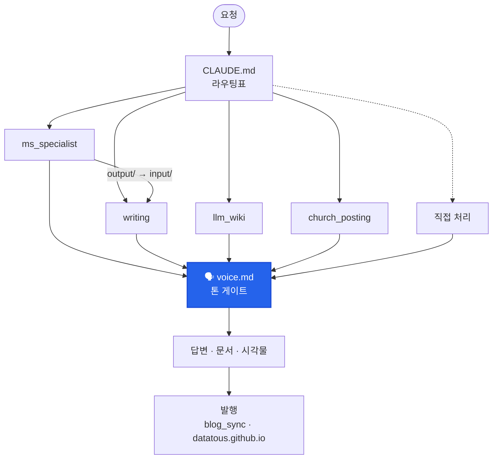

entity

## Summary
> **한 줄로** — 내가 Claude Code 위에 직접 만든 개인 자동화 하네스다. **폴더 하나가 작업자(워커) 한 명**이고, 요청은 `CLAUDE.md` 라우팅표를 보고 맞는 워커로 바로 간다. 2026-09-23 v12 기준 워커 9 · 에이전트 8 · 스킬 7.

사무실에 비유하면 이렇다. 워커는 각자 자기 책상(폴더)에서 일하고, 서로 말을 걸지 않는다. 앞사람이 `output/` 트레이에 서류를 두면 뒷사람이 `input/` 트레이에서 가져간다. 안내데스크(오케스트레이터)는 v12에서 없앴다. 이제는 벽에 붙은 안내표(`CLAUDE.md`) 한 장이 그 역할을 한다. 블로그 발행, 지식 위키, MS 업데이트 추적, 논문, 개인 생활 도메인까지 맡기고 있다.

## Key Facts
- **구조는 expert pool + 얕은 pipeline** — 키워드로 도메인 워커를 고르고, 이어지는 경로는 MS 업데이트 → 문서 하나뿐이다. supervisor(`henry-orchestrator`)는 2026-09-23에 폐기했다.
- **라우팅 SSOT = `CLAUDE.md` 표 하나** — 라우터 에이전트를 한 단 더 거치면 컨텍스트가 두 번 쌓인다.
- **정의는 한 벌** — 에이전트는 `.claude/agents/*.md`, 스킬은 `.claude/skills/*/SKILL.md`, 둘 다 리포 루트에만 둔다. Codex 미러(`.codex/`·`.agents/`)는 drift 30/40으로 폐기했다.
- **훅은 2개** — 음성 모드용 `UserPromptSubmit`(토글)·`Stop`(답변 낭독)만. 세션 기록·백업·위키 발행은 `/save-log`와 명시 실행으로 돌린다.
- **세션 고정 로딩 14,946자 / 예산 20,000자** — 8월 기준선 20,629자에서 v12로 14,253자(−31%), 이후 톤 규칙을 얹어 지금 값이 됐다.
- **구조는 사람이 아니라 스크립트가 잰다** — `python tools/harness_map.py --check`가 0 issues여야 정상이다.

## Details

### 요청 하나가 흐르는 길

- **워커별 담당 에이전트** — `ms_specialist` → `update-tracker-agent`, `writing` → `write-for-me`·`write-for-company`, `llm_wiki` → `wiki-ingest`·`wiki-query`·`wiki-lint`, `church_posting` → `church-poster`. `thesis`·`portfolio`·`automation-series`와 개인 생활 도메인은 메인 세션이 직접 처리한다.
- **웹 조사는 `research-agent`가 공용으로** 맡는다. 일부러 Write·Bash 권한을 주지 않았다. 믿을 수 없는 웹 콘텐츠를 다루니까 격리하는 거다.
- **모든 산출은 `knowledge/voice.md`를 거친다.** 글이면 `writing-styles.md`, 시각물이면 `frontend-design` 스킬이 추가로 붙는다. 별도 명령이 아니라 에이전트 8개의 "내보내기 직전" 단계에 박혀 있다.
- 라우팅표 원문은 여기 옮겨 적지 않는다. 같은 표를 두 곳에 두면 반드시 어긋난다는 게 이 시스템이 배운 교훈이다. 정본은 `CLAUDE.md`다.

### 지금 물려 있는 것 (2026-09-23 실측)

| 구분 | 수 | 목록 |
|------|----|------|
| 에이전트 | 8 | `church-poster` · `research-agent` · `update-tracker-agent` · `wiki-ingest` · `wiki-lint` · `wiki-query` · `write-for-company` · `write-for-me` |
| 스킬 | 7 | `analyze-me` · `new-task` · `optimize` · `publish-post` · `save-log` · `status` · `style` |
| 훅 | 2 | `UserPromptSubmit` → `voice-hook.ps1` · `Stop` → `session_notify.ps1` |
| 휴면 워커 | 6 | `ppt_team_agent` · `data_analysis` · `ideaing` · `retrospective` · `higgsfield` · `daily_brief` → `archive/hibernated-workers/` |

### 메모리 — 4가지 타입

Claude Code 자동 메모리(`~/.claude/projects/<프로젝트>/memory/`)를 쓴다. 파일 하나에 사실 하나를 담고, `MEMORY.md`가 인덱스다. 인덱스는 매 세션 로드되니까 한 줄씩만 쓴다.

- `user` — 나에 대한 것(역할, 선호, CLI 숙련도)
- `feedback` — 내가 교정하거나 확인해 준 작업 방식. 이유(Why)와 적용법(How to apply)을 같이 적는다
- `project` — 진행 중인 일의 상태·기한
- `reference` — 외부 시스템 포인터와 도구 함정

### 공개 위키 발행 — llm_wiki → datatous.github.io

`python tools/blog_sync/publish_wiki.py` 한 줄이 변환(`wiki_to_blog.py`)부터 블로그 repo 커밋·푸시까지 한다.

- **fail-closed** — 프론트매터에 `visibility: public`이 없으면 안 나간다. 공개 사이트라서 실수로 나가는 것보다 실수로 안 나가는 쪽이 낫다.
- **공개본은 읽기 좋게 가공한다** — `위키링크`는 실제 링크로 바꾸고, 문장마다 붙은 출처 태그는 페이지 끝 "근거 자료" 한 줄로 모은다. Mermaid 블록은 사이트에서 그림으로 렌더된다. 원본 규칙은 그대로 둔다.
- **발행은 한 체크아웃에서만** — 변환기는 "원본에 없는 공개 페이지는 지운다". 다른 체크아웃에서 발행하면 거기 없는 페이지가 사이트에서 사라진다.

### 음성 입출력

네이티브 슬래시 음성 명령이 막힌 환경이라 로컬 음성 MCP 도구(말하기·듣기·대화 한 턴·소음 보정)로 우회했다. 답변 자동 낭독은 `Stop` 훅이 한다. v12에서 훅을 거의 다 걷었을 때도 이 둘은 남겼다.

### 걸어온 길

| 시점 | 구조 |
|------|------|
| 2026-05 | Orchestrator + Worker. 라우터 에이전트가 요청을 받아 워커로 분배 |
| 2026-08-21 | 사수/부사수(producer-reviewer) 폐기 — 5개월 가동률 0% |
| 2026-09-08 | "hook 다 꺼" — 3개 scope의 command 24개 비활성화 |
| 2026-09-09 | Orca 워크트리 감사, 저사용 스킬 3종·워커 1개 archive |
| 2026-09-23 | **v12** — Codex 미러·supervisor 폐기, 워커 14→9, 훅 7→2, `harness_map.py`, 톤 SSOT |

어떻게 줄였는지는 [하네스 다이어트: 실측으로 워커를 내리는 법](/wiki/concept-harness-diet-measurement-driven-pruning/)에, 줄인 구조를 어떻게 지키는지는 [그림도 검사 대상으로: 실측에서 생성하는 배선도](/wiki/concept-generated-diagrams-as-consistency-checks/)에 따로 정리했다.

## Connections
- → [하네스 다이어트: 실측으로 워커를 내리는 법](/wiki/concept-harness-diet-measurement-driven-pruning/) : 14개까지 늘었던 워커를 9개로 줄인 방법
- → [그림도 검사 대상으로: 실측에서 생성하는 배선도](/wiki/concept-generated-diagrams-as-consistency-checks/) : `harness_map.py --check`와 자동 생성 배선도
- → [Harness Engineering](/wiki/concept-harness-engineering/) : 이 시스템이 따르는 상위 관점
- → [12 Agentic Harness Patterns](/wiki/concept-12-harness-patterns/) : 패턴 목록. 여기서 폐기한 supervisor와 겹치는 항목이 있다
- → [Claude Code Architecture](/wiki/concept-claude-code-architecture/) : 기반 아키텍처
- → [메일 첨부파일 자동화의 MCP 제약과 우회 경로](/wiki/concept-mail-attachment-automation-constraint/) : 개인 데이터 파이프라인을 붙일 때의 제약
- → [로컬 음성 에이전트 파이프라인 구성 패턴 (Windows)](/wiki/concept-local-voice-agent-pipeline/) : 음성 입출력 확장의 상세

## Open Questions
- 워커 간 `output/ → input/` 전달은 아직 메인 세션이 손으로 이어 준다. 자동 연결은 미완성이다.
- 리포 밖 층(클라우드 루틴)과 파이썬 import 참조는 `--check`가 못 본다.
- 토큰 사용량은 세션 단위로만 본다. 워커별 비용 대시보드는 없다.

<b>근거 자료</b> <code>023-harness-v12-orchestration-slimming-2026-09-23.md</code> · <code>026-harness-v12-technical-details-2026-09-23.md</code> · <code>024-harness-generated-diagram-check-gate-2026-09-23.md</code> · <code>007-harness-claude-md-snapshot.md</code> · <code>025-wiki-publish-pipeline-fixes-2026-09-23.md</code> · <code>013-voice-control-mcp-2026-07-31.md</code>

